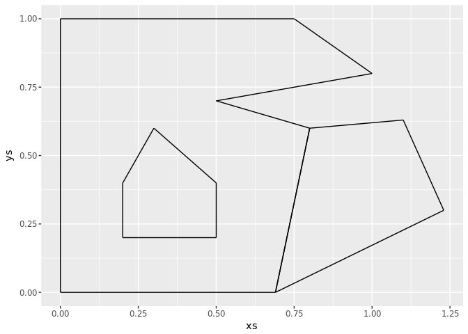
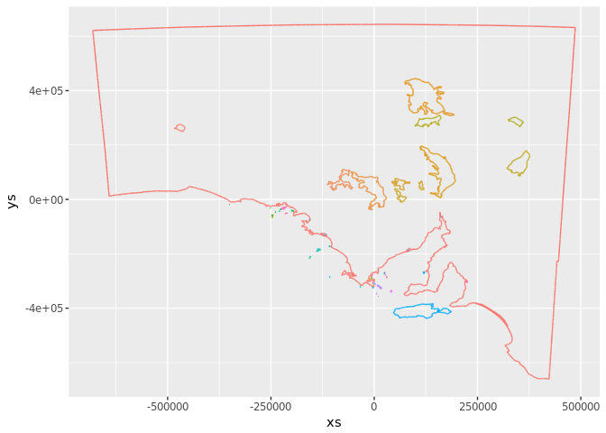
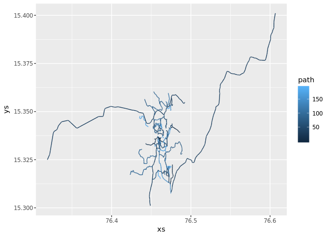

<!-- README.md is generated from README.Rmd. Please edit that file -->
Overview
========

This is a super stripped down core for silicate. All it has is the SC0 model, which is

-   `coord`, all coordinates from the input
-   `segment`, the .vx0 and .vx1 index of every input segment (row of coord)
-   `geometry` map (the record of any paths, `cumsum(nrow)` is a count-index into coord)
-   `data` (the feature table)

Compare with silicate:

``` r
library(silicate)
library(silicore)
str(sc_coord(minimal_mesh))
#> Classes 'tbl_df', 'tbl' and 'data.frame':    19 obs. of  2 variables:
#>  $ x_: num  0 0 0.75 1 0.5 0.8 0.69 0 0.2 0.5 ...
#>  $ y_: num  0 1 1 0.8 0.7 0.6 0 0 0.2 0.2 ...
str(SC0(minimal_mesh)$coord) ## exactly the same
#> Classes 'tbl_df', 'tbl' and 'data.frame':    19 obs. of  2 variables:
#>  $ x_: num  0 0 0.75 1 0.5 0.8 0.69 0 0.2 0.5 ...
#>  $ y_: num  0 1 1 0.8 0.7 0.6 0 0 0.2 0.2 ...
```

``` r
sc_edge(minimal_mesh)     ## relational labels
#> # A tibble: 15 x 3
#>    .vertex0   .vertex1   edge_     
#>    <chr>      <chr>      <chr>     
#>  1 fc6c1cd13b 43abd2fcb0 746da8f7e4
#>  2 43abd2fcb0 3b3e5bd015 69ab76a2e7
#>  3 3b3e5bd015 b58bcd847d 20d06a1532
#>  4 b58bcd847d 0ba2326a0f 296d3f7719
#>  5 0ba2326a0f 54aa78fa82 01ef7f396b
#>  6 54aa78fa82 f491eb1f98 c2f844f05b
#>  7 f491eb1f98 fc6c1cd13b abda0e82aa
#>  8 92f3167e61 672dd3d95f af2b65d1df
#>  9 672dd3d95f 847c3637ed 0c5a2fb0e3
#> 10 847c3637ed 30b1635c09 d5a9fd481f
#> 11 30b1635c09 8f786085e3 de296cd00f
#> 12 8f786085e3 92f3167e61 bc9906cbb7
#> 13 54aa78fa82 c8e8fe7c54 30c041f75b
#> 14 c8e8fe7c54 67efd02ad7 334d00688b
#> 15 67efd02ad7 f491eb1f98 aa12580325
SC0(minimal_mesh)$segment ## purely structure index
#> # A tibble: 16 x 2
#>     .vx0  .vx1
#>    <int> <int>
#>  1     1     2
#>  2     2     3
#>  3     3     4
#>  4     4     5
#>  5     5     6
#>  6     6     7
#>  7     7     8
#>  8     9    10
#>  9    10    11
#> 10    11    12
#> 11    12    13
#> 12    13    14
#> 13    15    16
#> 14    16    17
#> 15    17    18
#> 16    18    19
```

``` r
sc_path(minimal_mesh)      
#> # A tibble: 3 x 7
#>    ncol type         subobject object object_    path_      ncoords_
#>   <int> <chr>            <int>  <int> <chr>      <chr>         <int>
#> 1     2 MULTIPOLYGON         1      1 f7c088ba3e 1e257fa84e        8
#> 2     2 MULTIPOLYGON         1      1 f7c088ba3e e06e67154a        6
#> 3     2 MULTIPOLYGON         1      2 565676f05b 4a5fd36519        5
SC0(minimal_mesh)$geometry ## no relational labels
#> # A tibble: 3 x 6
#>    nrow  ncol type         subobject object  path
#>   <int> <int> <chr>            <int>  <int> <int>
#> 1     8     2 MULTIPOLYGON         1      1     1
#> 2     6     2 MULTIPOLYGON         1      1     2
#> 3     5     2 MULTIPOLYGON         1      2     3
```

``` r
sc_object(minimal_mesh)  
#> # A tibble: 2 x 1
#>       a
#> * <int>
#> 1     1
#> 2     2
SC0(minimal_mesh)$data  ## the same, geometry$object is the row number
#> # A tibble: 2 x 1
#>       a
#> * <int>
#> 1     1
#> 2     2
```

Performance is good.

``` r
rbenchmark::benchmark(SC0(minimal_mesh), 
                      SC(minimal_mesh))
#>                test replications elapsed relative user.self sys.self
#> 2  SC(minimal_mesh)          100   2.034    1.569     2.027    0.004
#> 1 SC0(minimal_mesh)          100   1.296    1.000     1.272    0.024
#>   user.child sys.child
#> 2          0         0
#> 1          0         0
```

``` r
rbenchmark::benchmark(SC0(inlandwaters), 
                      SC(inlandwaters), replications = 10)
#>                test replications elapsed relative user.self sys.self
#> 2  SC(inlandwaters)           10  14.872   33.345    14.825    0.048
#> 1 SC0(inlandwaters)           10   0.446    1.000     0.442    0.004
#>   user.child sys.child
#> 2          0         0
#> 1          0         0
```

For now we are ignoring

-   relational indexes
-   geometric normalization (might be x/y, x/y/z, other spaces ...)
-   any explicitly sequential storage, i.e. ARC and PATH probably will be rebuilt completely

We import the internal `silicate:::get_projection.sf` and for now rely on `gibble` to give the mapping between coordinates and paths.

This is being tried because silicate was originally defined around PATH, and even SC was defined in terms of it - unnecessarily. Once [we tried](http://rpubs.com/cyclemumner/367272) a purely tidyverse approach to the problem of decomposing paths to edges it seemed natural to use that as a basis. It means that we can keep the run-length index (gibble) as a way of storing higher level groupings, including holes and multipolygons *optionally*. Here we don't need to encode the actual sequence of coordinates along paths or arcs, because i) it's implicit in geometry/coord tables prior to vertex de-duplication and ii) we might discard them favouring edge-traversal as a way of reconstructing sequences.

Can we get sense out of it?

``` r
x <- SC0(minimal_mesh)
library(ggplot2)
library(dplyr)
#> 
#> Attaching package: 'dplyr'
#> The following objects are masked from 'package:stats':
#> 
#>     filter, lag
#> The following objects are masked from 'package:base':
#> 
#>     intersect, setdiff, setequal, union
tab <- tibble(xs = x$coord$x_[x$segment$.vx0], ys = x$coord$y_[x$segment$.vx0], 
              xend = x$coord$x_[x$segment$.vx1], yend = x$coord$y_[x$segment$.vx1])
ggplot(tab, aes(xs, ys, xend  =xend, yend = yend)) + geom_segment()
```



``` r

x <- SC0(inlandwaters)
## the  sixth object
tst <- rep(x$geometry$object, x$geometry$nrow) == 4
idx <- which(tst)
g <-  rep(x$geometry$path, x$geometry$nrow)
segment <- x$segment %>% dplyr::filter(.vx0 %in% idx & .vx1 %in% idx)
tab <- tibble(xs = x$coord$x_[segment$.vx0], ys = x$coord$y_[segment$.vx0], 
              xend = x$coord$x_[segment$.vx1], yend = x$coord$y_[segment$.vx1], 
              path = g[segment$.vx0])
ggplot(tab, aes(xs, ys, xend  =xend, yend = yend, colour = factor(path))) + geom_segment() + guides(colour = FALSE)
```



``` r


x <- SC0(dodgr::hampi)
g <-  rep(x$geometry$path, x$geometry$nrow)
tab <- tibble(xs = x$coord$x_[x$segment$.vx0], ys = x$coord$y_[x$segment$.vx0], 
              xend = x$coord$x_[x$segment$.vx1], yend = x$coord$y_[x$segment$.vx1], 
              path = g[x$segment$.vx0])
ggplot(tab, aes(xs, ys, xend  =xend, yend = yend, colour = path)) + geom_segment()
```



If anyone can come up with a better name than `gibble` or `geometry` or `geometry map` for that thing, I'll be really grateful.

The Longer silicore Story
-------------------------

R needs an idiom for an abstract representation of shapes, I don't want developers to have to care about a particular format - I need a representation that's universal and that any format can be converted to, and that any format can be created from.

I've learnt a lot with [hypertidy/silicate](https://github.com/hypertidy/silicate) - and settled on a few models that make for a very general framework for various types of hierarchical data. They are `SC` (universal, edges+vertices), `TRI` (triangles+vertices), `ARC` (shared-boundaries, or unique-paths+vertices), `PATH` (simple features alike, composed of sequential paths of coordinates). However, these aren't fundamental enough, and different applications require either more models defined, or to use some combination of these. For example `anglr::QUAD` can do rasters, and allow them to be losslessly reprojected, dense-storage of virtual rect polygons, and TRI can be thought of as either PATH, or SC but oftens needs a little of both.

<ol type="a">
<li>
Coffee
</li>
<li>
Tea
</li>
<li>
Milk
</li>
</ol>
All of these models also store **object**, a kind of placeholder for grouping primitives, lines, or polygons into higher levels. Object can be virtual - or missing - and that leads to efficiencies like a virtual vertex pool for QUAD, which is *virtual* (stored as a few parameters) right up until we actual want a reprojected set of rects, or we want to cull out some of the primitives.

And then it gets messy again, none of these is really bare-bones or universal in current form. There's no POINT model, and so we get funny quirks like having a super-powerful edge-based triangulation engine (`anglr::DEL`) as well as a path-based one (TRI, via `decido`) but no obvious way to build a TRI from a set of points.I've been using a degenerate form of PATH, a kind of trick that treats a point as a zero-length line, but again that needs extra stuff to keep it efficient and virtualize the links and groupings.

The Crazy Idea
--------------

### Paths

If you have something PATH-like (sf/sp/osm/spatstat/GPS polygons, lines) then the natural decomposition is

1.  the coordinates
2.  the edges (if any)
3.  the paths (if any)
4.  higher levels (i.e. features, the objects, if any)

(The *if any* applies to i) as well, but in the sens of "what geometry", we might have a schedule for future data collection, and all we have is a time coordinate - in other cases we might know the topology, there are ten edges, but we don't know the value of their nodes yet, or perhaps they change over time).

### Primitives

If we have something SC or TRI-like (rgl, icosa, geometry::delaunayn) composed of edges or triangles, constant-length indexes into a vertex pool) then the natural decomposition is

1.  the vertices
2.  the primitives (two nodes for an edge, three for a triangle, etc.).
3.  higher level groupings

For i) I mean *all coordinates*, including duplication, in the order they come (i.e. all sf matrices rbinded together, like st\_coordinates does). For a) I mean unique coordinates (unique in x/y, or x/y/z or whatever geometric space it was).

For ii) this is the straightforward index of every pair of coordinates from every path, the two-column table of edges, each pairing of coordinates *in order* through each path. It's a natural starting point for many analyses (including [fasterize](https://github.com/ecohealthalliance/fasterize), transport applications like [dodgr](https://github.com/ATFutures/dodgr), constrained Delaunay triangulations, any topological or neighbour-based spatial analysis, visualizations with `rgl` and so forth). Some of these require a dense vertex set, only unique coordinates - not all instances of them, which is why I make this distinction already here. Not all applications need unique coordinates, and one of the silicate lessons is that premature densification is not your friend. A nuance is when or if to also deduplicate edges themselves, as they occur in directed or undirected forms.

Crucially, from this set of edges and coordinates we can create other types. Key examples are de-duplication in geometry (create unique vertices, and badge edge-node indexes uniquely) which gives topology for neighbours or 3D graphics, or culling out holes, splitting paths into simpler features and so on. Here ii) is analogous to b) but applied to all coordinates, where b) implies a dense vertex pool (it doesn't really matter, some ops need unique vertices, and some apps will have a different def i.e. unique in x/y/z rather than x/y so it needs to be open for re-indexing).

For iii) this is every separate sequence of coordinates, linesrings or rings. This *tiny*, a single record for each path of its length (`nrow` of the `sf` atomic matrix), its type (POLY, LINE,...), the feature id, the sub-feature part-id, is it a hole, and whatever else. The key part of iii) is that it gives you a run-length encoding of how to split up the coordinates in i) to reconstruct the source, or to construct something analogous to it.

For iv) that can actually be virtual, copied out onto every path iii) or stored by other means, it's not complicated - the real key is not copying everything onto every coordinate! (This was a really confusing part of `ggplot2` with fortify, and remains a gap in that framework that projects like `ggraph` and `tidygraph` are aiming to fill).

I'm loathe to put classes or formal definitions on these, though some kind of high level summary would be nice. I see this as a core part of an R API for working within and around spatial data in its various forms. It's meant to be bare-metal, but accessible - very flexible, you can shoot your foot but with lots of basics available like point-in-poly, path-reconstruction-from-edges, distance-to and distance-from, discretization and other forms of coordinate transformation (that's my list of things that I think are core spatial, for a bare-bones toolkit).

It makes a new POINT model trivial, it doesn't really need to be defined it's just i) all the coordinates and (optionally) iii) or iv) a set of values on each point, or a kind of group-table - how many coordinates per multipoint, a bit like path. So we can infer a base-level intention or meaning of this bag of entities purely from what's present, or not, and we apply our own meaning or intention without any baggage holding us back or requiring quirky workarounds for different formats.

It means we can have the core set i) coordinates and ii) edges which allows most analysis and conversion, and optionally keep track of iii) paths and their groupings/properties in iv). The application designer gets to choose when and how to ignore or persist the original information, and importantly allows silicate-like models to know when those records become invalidated, i.e. we've done some insane triangulation or edge-collapse or modification, we can't trust ii) anymore, but we could create new ones by tracing through edges and finding external boundaries, vs. shared internal ones

I've implemented this in bare prototype form here [silicore](https://github.com/hypertidy/silicore). I don't really intend silicore to exist long term in any meaningful way, I hope that it helps define the core of silicate once I try out these workflows a bit more. Keen for any feedback!
